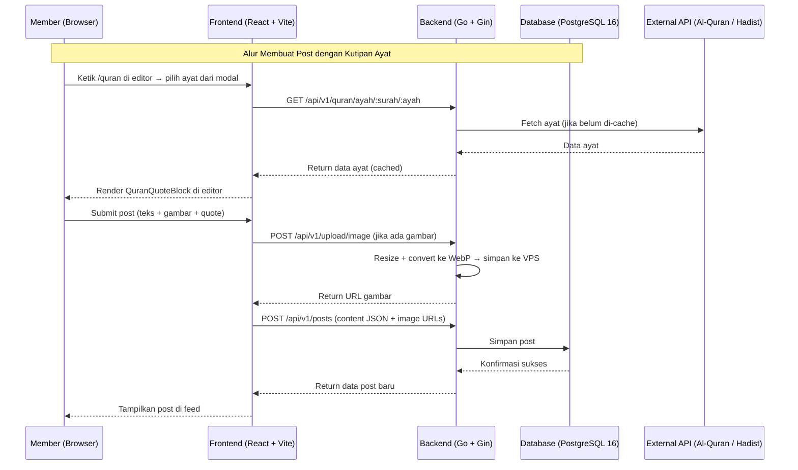
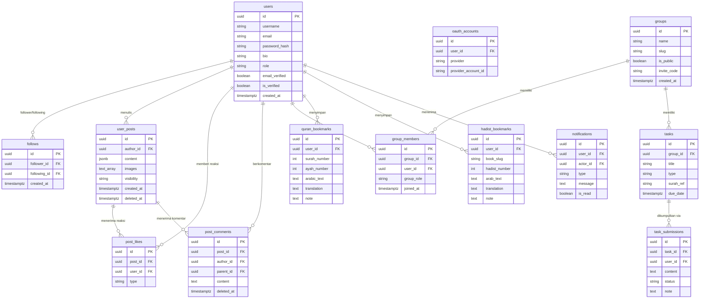

# PRD — Ilmuna: Platform Pengajian & Komunitas Islam Digital

> _"Ilmu kita bersama."_

## 1. Overview

Ilmuna adalah platform digital yang menggabungkan tiga dimensi pengalaman belajar Islam dalam satu produk: **grup pengajian privat**, **feed sosial Islami**, dan **referensi Al-Quran & Hadist** lengkap.

Masalah utama yang ingin diselesaikan adalah fragmentasi ekosistem belajar Islam digital saat ini — komunitas pengajian berpencar di WhatsApp Group, konten Islami tersebar di media sosial umum yang penuh distraksi, dan referensi Al-Quran/Hadist tersimpan di aplikasi terpisah. Ilmuna menyatukan ketiganya dalam satu platform yang bersih, fokus, dan sesuai konteks.

Tujuan utama adalah menyediakan ruang digital bagi komunitas Muslim Indonesia untuk belajar bersama ustadz mereka, berbagi konten Islami secara sosial, dan mengakses referensi keagamaan — semuanya dalam satu akun, satu antarmuka, tanpa distraksi.

## 2. Requirements

Berikut adalah persyaratan tingkat tinggi untuk pengembangan sistem:

- **Aksesibilitas:** Aplikasi berbasis Web (React SPA), mobile-first, responsif hingga HP dengan RAM 3GB. Tidak ada aplikasi native di V1.
- **Pengguna:** Tiga role — Member (pengguna umum), Ustadz (admin grup), dan Platform Admin (moderasi global).
- **Autentikasi:** Email/password dan Google OAuth. Semua sesi dikelola via JWT dengan refresh token rotation.
- **Konten:** Post publik berformat rich text (teks + gambar + kutipan Al-Quran). Gambar diproses server-side: resize dan konversi ke WebP sebelum disimpan.
- **Referensi Islam:** Al-Quran (114 surah, teks Arab + terjemahan Indonesia) dan Hadist (multi-kitab) diakses via API eksternal yang di-proxy dan di-cache di backend.
- **Penyimpanan File:** Lokal di VPS, di-serve via Nginx sebagai static file server. Tidak bergantung pada layanan cloud pihak ketiga.

## 3. Core Features

Fitur-fitur kunci yang harus ada dalam versi pertama (MVP):

1. **Landing Page**
   - Parallax scroll dengan pola geometri Islam SVG hitam-putih.
   - Menampilkan satu ayat Al-Quran acak (live dari API) per kunjungan.
   - CTA ke Register dan Login, ringkasan fitur utama, serta cara kerja platform.

2. **Autentikasi & Profil**
   - Register, login (email/password dan Google OAuth), verifikasi email.
   - Profil publik dengan foto, cover, bio, lokasi, website, dan daftar post.
   - Sistem followers/following antar pengguna.

3. **Feed Sosial Publik**
   - Post composer dengan Tiptap rich text editor: teks, gambar (max 4, max 5MB/gambar), dan sisipan kutipan Al-Quran via slash command `/quran`.
   - Interaksi: like, dislike, komentar (threaded), dan share.
   - Feed personal (dari akun yang diikuti) dan halaman Explore (post publik populer).

4. **Grup Pengajian**
   - Buat dan kelola grup dengan kode undangan.
   - Forum diskusi internal (post + komentar berulir).
   - Upload materi (teks, link, PDF).
   - Sistem tugas hafalan: buat tugas → siswa kumpulkan → ustadz review (accepted/revision).

5. **Referensi Al-Quran**
   - Daftar 114 surah dengan teks Arab, transliterasi, dan terjemahan Indonesia.
   - Per ayat: tombol bookmark dan salin. Navigasi prev/next surah.
   - Halaman bookmark pribadi dengan catatan per ayat.
   - Slash command `/quran` di editor post untuk menyisipkan kutipan ayat.

6. **Referensi Hadist**
   - Akses multi-kitab (Bukhari, Muslim, Abu Dawud, Tirmidzi, Nasa'i, Ibnu Majah, Muwatha, Musnad Ahmad).
   - Per hadist: teks Arab, terjemahan, perawi, tombol bookmark.
   - Halaman bookmark pribadi dengan catatan per hadist.

7. **Notifikasi In-App**
   - Notifikasi untuk: follower baru, post dilike/dikomentari, komentar dibalas, tugas baru, materi baru, dan hasil review tugas.

8. **Panel Admin**
   - Kelola semua user dan grup, moderasi konten, statistik platform.

## 4. User Flow

### Alur Member Baru

1. **Daftar:** Buat akun via email atau Google OAuth → verifikasi email.
2. **Eksplorasi:** Lihat halaman Explore untuk menemukan post publik dan grup pengajian.
3. **Ikuti:** Follow pengguna lain atau bergabung ke grup pengajian (via kode undangan atau grup publik).
4. **Konsumsi:** Baca feed personal, akses Al-Quran/Hadist, lihat materi dan tugas grup.
5. **Berkontribusi:** Buat post publik (dengan kutipan ayat opsional), berikan komentar, kumpulkan tugas.

### Alur Ustadz (Grup Admin)

1. **Buat Grup:** Isi nama, deskripsi, dan atur apakah grup publik atau via undangan.
2. **Undang Anggota:** Bagikan kode undangan.
3. **Kelola Konten:** Upload materi, buat tugas hafalan, posting di forum grup.
4. **Review:** Buka daftar submission tugas → berikan status accepted atau revision beserta catatan feedback.

### Alur Referensi Islam

1. **Buka Al-Quran/Hadist:** Pilih dari navigasi sidebar.
2. **Baca:** Cari surah atau browse per kitab hadist.
3. **Bookmark:** Klik ikon bookmark pada ayat/hadist → opsional tambahkan catatan pribadi.
4. **Kutip ke Post:** Saat menulis post, ketik `/quran` di editor → pilih ayat dari modal picker → blok kutipan ter-render otomatis di post.

## 5. Architecture

## 6. Database Schema

Berikut adalah Entity Relationship Diagram (ERD) yang menggambarkan relasi antar tabel utama:

| Tabel                | Deskripsi                                                                               |
| -------------------- | --------------------------------------------------------------------------------------- |
| **users**            | Master data pengguna, mendukung auth email/password dan Google OAuth                    |
| **oauth_accounts**   | Data akun OAuth per provider (Google), terhubung ke users                               |
| **follows**          | Relasi follower/following antar pengguna                                                |
| **user_posts**       | Konten post publik dalam format Tiptap JSON (teks + gambar + kutipan)                   |
| **post_likes**       | Reaksi like/dislike pengguna pada post                                                  |
| **post_comments**    | Komentar threaded pada post (mendukung reply via parent_id)                             |
| **groups**           | Grup pengajian, bisa publik atau via kode undangan                                      |
| **group_members**    | Keanggotaan grup dengan role: ustadz, moderator, atau student                           |
| **tasks**            | Tugas hafalan dalam grup (hafalan, catatan, bacaan, lainnya)                            |
| **task_submissions** | Pengumpulan tugas siswa dengan status review dari ustadz                                |
| **quran_bookmarks**  | Bookmark ayat Al-Quran per pengguna, lengkap dengan cache teks Arab dan catatan pribadi |
| **hadist_bookmarks** | Bookmark hadist per pengguna, lengkap dengan cache teks dan catatan pribadi             |
| **notifications**    | Notifikasi in-app untuk semua event platform                                            |

## 7. Design & Technical Constraints

1. **High-Level Technology:**
   Sistem dibangun dengan arsitektur fullstack terpisah: **React 19 + Vite 6 + TanStack Router** untuk frontend (SPA), dan **Go 1.23 + Gin + GORM + PostgreSQL 16** untuk backend REST API. Frontend di-host di Vercel/Cloudflare Pages; backend di Railway/Fly.io/VPS dengan Docker. File upload disimpan lokal di VPS dan di-serve via Nginx — tidak bergantung pada layanan object storage eksternal di V1.

2. **Performance & Mobile Targets:**
   Aplikasi harus dapat berjalan lancar di perangkat mobile dengan RAM 3GB. Strategi wajib: TanStack Virtual untuk semua list panjang (feed, daftar surah, daftar hadist), infinite scroll dengan 10 item per halaman, lazy loading gambar, konversi gambar ke WebP di server, dan code splitting per route via TanStack Router lazy loading.

3. **API Caching — Al-Quran & Hadist:**
   Data Al-Quran dan Hadist bersifat statis. Backend **wajib** meng-cache respons dari API eksternal di in-memory cache (go-cache). Daftar surah di-pre-load saat server startup; detail per surah di-cache lazy dengan TTL 1 jam. Jika API eksternal down, backend mengembalikan versi cache terakhir.

4. **Image Processing:**
   Semua gambar yang diunggah (avatar, cover, gambar post, materi) diproses server-side sebelum disimpan: validasi tipe (jpeg/png/webp/gif), batas ukuran max 5MB, resize ke maksimal 1200px lebar (800px untuk avatar), lalu dikonversi ke WebP. Maksimal 4 gambar per post.

5. **Typography Rules:**
   Antarmuka (UI) wajib menggunakan konfigurasi font sebagai berikut:
   - **Heading & UI:** Inter (Google Fonts)
   - **Teks Arab (Al-Quran/Hadist):** Scheherazade New atau Amiri, `dir="rtl"`, font-size 22–26px, di-preload hanya pada halaman Al-Quran/Hadist
   - **Mono:** JetBrains Mono

6. **Design System:**
   Palet warna dominan hitam-putih (background `#FFFFFF`, teks `#111111`) dengan aksen emas `#C9A84C` khusus untuk elemen kutipan Al-Quran, ornamen, dan bookmark aktif. Layout 3-kolom di desktop (sidebar 240px + konten utama + right panel 300px), 2-kolom di tablet, dan 1-kolom dengan bottom navigation bar di mobile.

7. **Non-Goals V1:**
   Slash command `/hadist` di editor, streaming video, payment/donasi, aplikasi mobile native, notifikasi push browser, mode mushaf Al-Quran per halaman, dan audio tilawah — semua ditunda ke V2.
